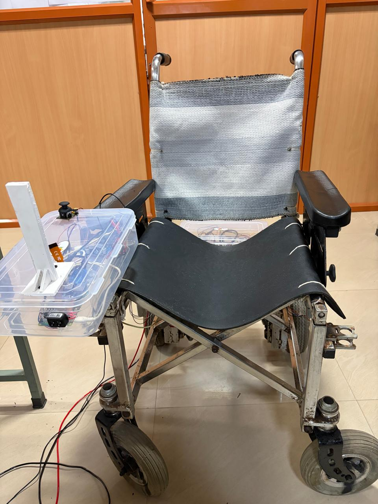
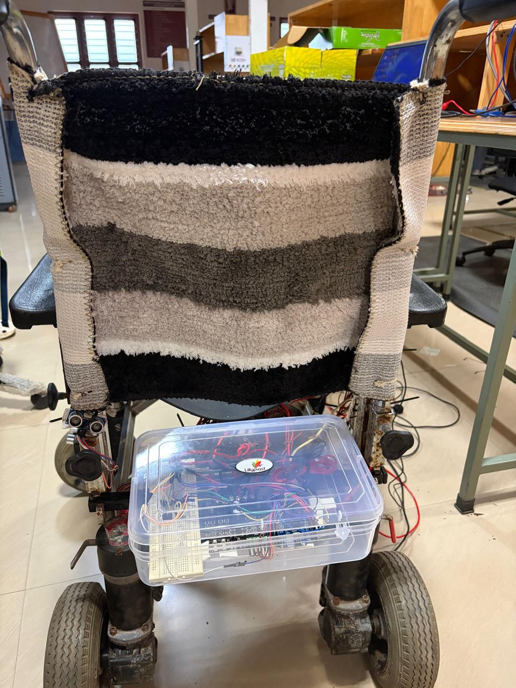

# ♿ Solar-Powered Smart Wheelchair with AI Voice & Gesture Control


## 📌 Overview
An intelligent solar-powered Smart wheelchair that uses AI to allow
hands-free control through voice commands and hand gestures.
Built and deployed on Raspberry Pi with real-time obstacle detection.

## 🎯 Features
- 🎙️ **Voice Control** — say Forward, Backward, Left, Right, Stop
- 🖐️ **Gesture Control** — hand gestures via Pi Camera + MediaPipe
- 🚧 **Obstacle Detection** — auto-stops using TF-Luna LiDAR + ultrasonic sensors
- ☀️ **Solar Powered** — sustainable energy for extended use
- 🔒 **Thread-Safe** — voice and gesture run simultaneously without conflict
- 🛑 **Safety First** — auto-stop on hand loss, timeout, or disconnection

---

## 🛠️ Tech Stack
| Layer | Technology |
|---|---|
| Language | Python, C++ (Arduino) |
| AI Models | TensorFlow Lite, Keras |
| Computer Vision | OpenCV, MediaPipe |
| Audio | Librosa, PyAudio |
| Hardware | Raspberry Pi 4, Arduino Uno |
| Sensors | TF-Luna LiDAR, HC-SR04 Ultrasonic x3 |
| Motors | Cytron Motor Driver |
| Power | Solar Panel Integration |

---

## 🧠 AI Models

### Voice Control
- **Input:** 1 second audio → Mel Spectrogram (40×32)
- **Architecture:** CNN
- **Commands:** Forward, Backward, Left, Right, Stop
- **Deployed as:** `.tflite` on Raspberry Pi

### Gesture Control
- **Input:** 30 frames of hand landmarks (42 points each)
- **Architecture:** Conv1D + GRU
- **Commands:** LEFT, RIGHT, FORWARD, BACKWARD, STOP
- **Deployed as:** `.tflite` on Raspberry Pi

---

## ⚙️ How It Works
1. **Voice thread** captures mic audio → Mel spectrogram → TFLite model → command
2. **Gesture thread** reads Pi Camera → MediaPipe landmarks → GRU model → command
3. **Sender thread** continuously sends the active command to Arduino every 150ms
4. **Arduino** receives command → checks sensors → drives motors safely

---

## 🔧 Hardware Wiring
| Component | Pin |
|---|---|
| TF-Luna LiDAR | TX→12, RX→13 (SoftwareSerial) |
| Ultrasonic Front | Trig→2, Echo→3 |
| Ultrasonic Left | Trig→4, Echo→7 |
| Ultrasonic Back | Trig→10, Echo→11 |
| Motor 1 | PWM→5, DIR→8 |
| Motor 2 | PWM→6, DIR→9 |
| Joystick | VRX→A0, VRY→A1 |

---

## 📁 Project Structure
```
solar-wheelchair-ai/
├── main_system1.py                         # Master controller (Raspberry Pi)
├── requirements.txt                        # pip dependencies
├── environment.yml                         # Conda environment (Raspberry Pi)
├── voice_control/
│   ├── voice_control_model.ipynb           # Voice model training notebook
│   ├── voice_modelmodified.h5              # Trained Keras model
│   └── voice_modelmodified.tflite          # Deployed TFLite model
├── gesture_control/
│   ├── gesture_model_smartwheelchair.ipynb # Gesture model training
│   └── gesture_model_gru.tflite            # Deployed TFLite model
├── obstacle_detection/
│   └── Arduino_code.ino                    # Arduino motor + sensor controller
└── docs/
    ├── wheelchair.jpeg                     # Hardware photo 1
    ├── wheelchair1.jpeg                    # Hardware photo 2
    ├── Voice control.mp4                   # Voice control demo
    ├── gesture control.mp4                 # Gesture control demo
    └── Joystick control.mp4                # Joystick control demo
```

---

## 🚀 How to Run

### Setup (Raspberry Pi with Miniforge)
```bash
conda env create -f environment.yml
conda activate voice_env
python main_system1.py
```

### Connect Hardware
```
- Arduino via USB (/dev/ttyUSB0 or /dev/ttyACM0)
- Raspberry Pi Camera module
- USB Microphone
```

### Upload Arduino Code
```
- Open obstacle_detection/Arduino_code.ino in Arduino IDE
- Upload to Arduino Uno
```

### Voice Commands
Say: **Forward · Backward · Left · Right · Stop**

### Gesture Commands
Show hand to camera: **LEFT · RIGHT · FORWARD · BACKWARD · STOP**

---

## 📸 Hardware Demo

| View 1 | View 2 |
|---|---|
|  |  |

> Real hardware prototype showing solar-powered wheelchair with
> Raspberry Pi, camera module, and AI control system.

---

## 🎥 Demo Videos
| Video | Description |
|---|---|
| [Voice control.mp4](docs/Voice%20control.mp4) | Voice command navigation demo |
| [gesture control.mp4](docs/gesture%20control.mp4) | Hand gesture control demo |
| [Joystick control.mp4](docs/Joystick%20control.mp4) | Manual joystick fallback demo |

---

## 📄 Publication
This project is part of ongoing research submitted to IEEE.

## 👤 Author
**Achuoth Akol Achuoth Deng**
B.Tech EEE — Amrita Vishwa Vidyapeetham, India
[LinkedIn](https://linkedin.com/in/achuoth-akol-achuoth-deng) · [GitHub](https://github.com/Achuoth11)
